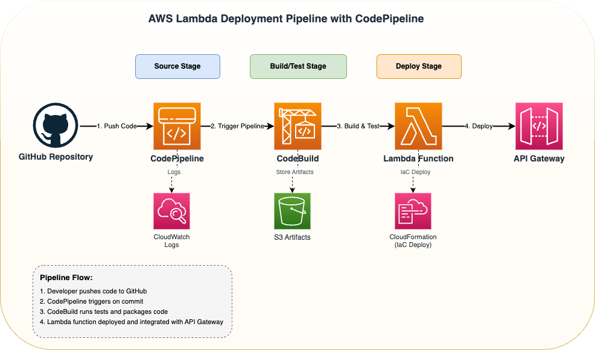

# AWS re:Invent 2025

Repository for AWS re:Invent 2025 demo projects and presentations.

## About

This repository contains demo projects, code samples, and resources for AWS re:Invent 2025. Each demo project showcases various AWS services, architectures, and best practices.

## Event Information

Detailed information about AWS re:Invent 2025 is available in the [event-info](./event-info) folder:

- [Overview](./event-info/overview.md): General conference details, time, and location
- [Schedule](./event-info/schedule.md): High-level event schedule
- [Topics](./event-info/topics.md): Interesting topics and session ideas

## Architecture



## Repository Rules

This repository enforces rules for branch naming, commit messages, and protected branches to maintain code quality and consistency.

### Branch Naming Convention
- **Pattern:** `type/jira-123` (lowercase, kebab-case)
- **Examples:** `feature/jira-123`, `bugfix/proj-456`, `hotfix/issue-789`

### Commit Message Convention
- **Pattern:** `jira-123: description` or `deps-auto: description` (lowercase)
- **Examples:** `jira-123: add user authentication`, `deps-auto: update terraform`

### Protected Branches
- **`main`** - Production branch (requires PR with 1 approval)
- **`dev`** - Development branch (requires PR with 1 approval)

No force pushes or deletions allowed on protected branches.

### Version Tags
- **Pattern:** `v*` (e.g., `v1.0.0`, `v2.1.3-alpha`)
- Protected from force updates and deletions

### Required Status Checks
Before merging to `main` or `dev`, the following checks must pass:
- `pr-checks` - PR validation and testing

See [CONTRIBUTING.md](./CONTRIBUTING.md) for detailed guidelines.

## Repository Rulesets

All rules are defined in `/rulesets/` and can be applied manually or via GitHub Actions.

See [rulesets/README.md](./rulesets/README.md) for details.

## Getting Started

1. **Clone the repository**
   ```bash
   git clone <repository-url>
   cd aws-re-invent-2025
   ```

2. **Checkout the dev branch**
   ```bash
   git checkout dev
   ```

3. **Create a feature branch**
   ```bash
   git checkout -b feature/jira-123
   ```

4. **Make changes and commit**
   ```bash
   git add .
   git commit -m "jira-123: implement new feature"
   ```

5. **Push and create PR**
   ```bash
   git push origin feature/jira-123
   ```

## Contributing

Please read [CONTRIBUTING.md](./CONTRIBUTING.md) for details on our code of conduct and the process for submitting pull requests.
